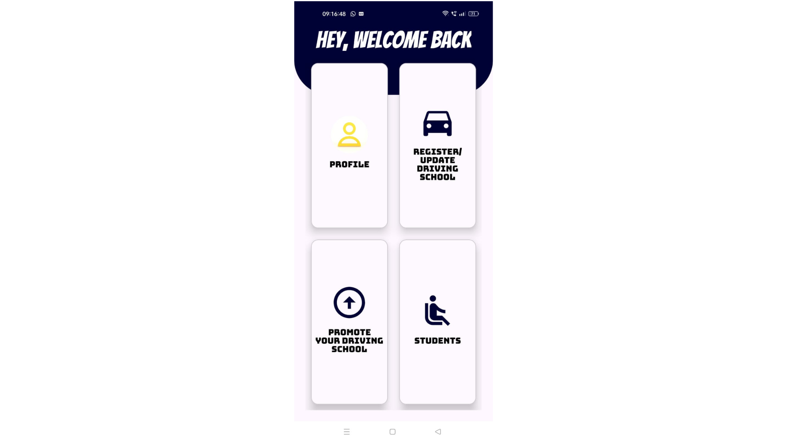
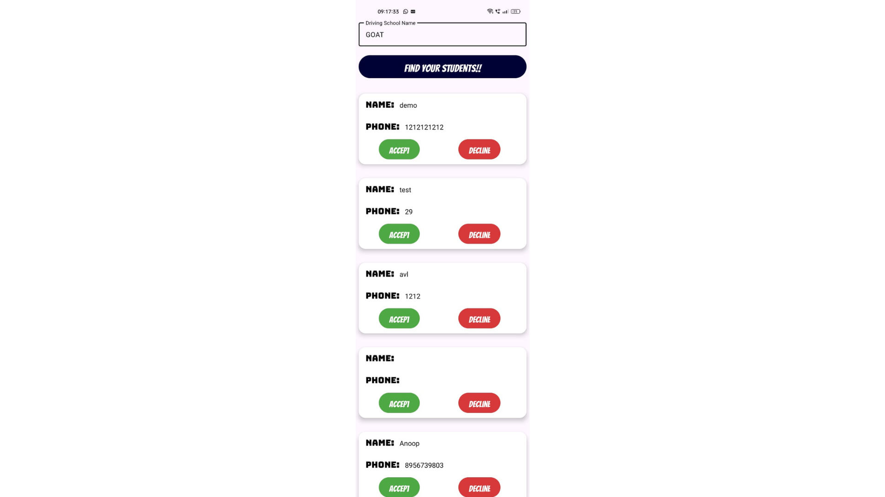
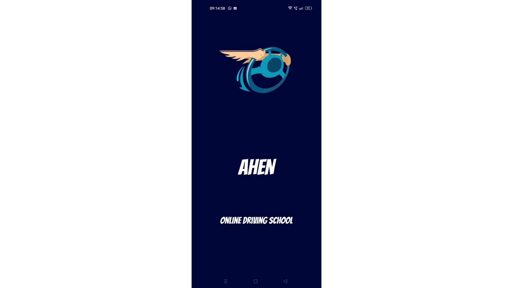

### AhenDS-Android

# Ahen Driver App

Welcome to the Ahen Driver App repository! This application is designed for driving school instructors to manage their sessions, track students, and facilitate driving lessons efficiently.

## Features

- **Session Management:** Easily schedule and manage driving sessions.
- **Student Tracking:** Keep track of student progress and attendance.
- **Profile Management:** Manage your instructor profile.
- **Notifications:** Receive notifications for upcoming sessions and student bookings.
- **Secure Payments:** Use Razorpay for secure and seamless payments.

## Technologies Used

- **Android Studio**
- **Java**
- **XML**
- **Firebase for Authentication and Database**
- **Google Maps API**
- **Razorpay for Payment Gateway**

## Installation

1. Clone the repository:
    ```bash
    git clone https://github.com/AnoopVL/AhenDS-Android.git
    ```
2. Open the project in Android Studio.
3. Build and run the project on your device or emulator.

## Usage

1. Log in with your instructor account.
2. Schedule available driving sessions.
3. Track student progress and attendance.
4. Manage your profile and update availability.

## Contributing

We welcome contributions! Please fork the repository and submit pull requests.

## Contact

For any inquiries or feedback, please reach out to [AnoopVL](https://github.com/AnoopVL) or contact.anoopvl@gmail.com 

## Screenshots




